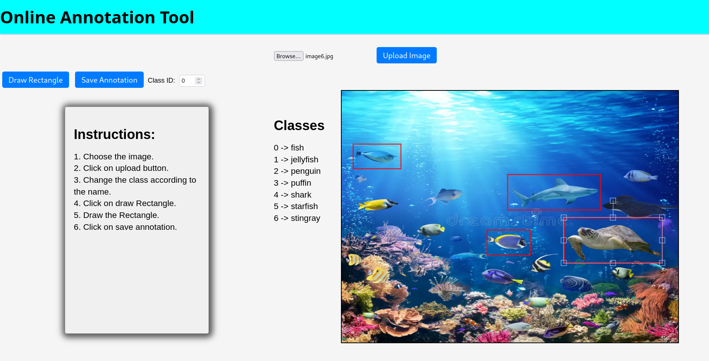

# Annotation-tool
  

<p>
this a online annotation tool for YOLO format dataset. it allows user to annotate image online at anytime from anywhere. it will help in the class incremental learning where the large dataset
</p>

## Features

- Intuitive drawing tools for creating bounding boxes around objects of interest.
- Easy selection of object classes for each annotation.
- Editing capabilities to adjust and refine annotations as needed.
- Web-based interface for seamless annotation directly within the browser.
- Export annotated data in the YOLO format for integration into machine learning pipelines.

## Getting Started

1. Clone the repository:

   ```bash
   git clone https://github.com/your-username/yolo-annotation-tool.git


Online Annotation Tool for YOLO Format Datasets

## Introduction

This project is an online annotation tool designed to facilitate the annotation process for YOLO format datasets used in object detection tasks. The tool provides a user-friendly interface for labeling images with bounding boxes around objects of interest and assigning corresponding class labels. It aims to streamline the annotation workflow, making it easier and more efficient for researchers and developers to create annotated datasets for training YOLO-based object detection models.
## Features

- User-friendly Interface: The tool offers an intuitive web-based interface that allows users to easily upload images and annotate them with bounding boxes.
- Bounding Box Annotation: Users can draw bounding boxes around objects of interest in the images and adjust their positions and sizes as needed.
- Class Label Assignment: The tool supports assigning class labels to annotated objects, allowing users to specify the type of objects present in the images.
- Real-time Preview: Users can preview the annotations in real-time as they annotate the images, facilitating quick verification and correction of annotations.
- Export Functionality: Annotated data can be exported in the YOLO format, making it compatible with YOLO-based object detection frameworks for further training and evaluation.

## Getting Started

To use the annotation tool, follow these steps:

1. Clone the repository to your local machine.
2. Open the index.html file in a web browser.
3. Upload images that you want to annotate.
4. Draw bounding boxes around objects in the images and assign class labels.
5. Export the annotated data in YOLO format for further use.

## Demo

## Contributing

Contributions to the project are welcome! If you find any bugs or have suggestions for new features, please open an issue or submit a pull request.
## License

This project is licensed under the MIT License.